# 🏗️ Architecture Diagrams

## System Architecture

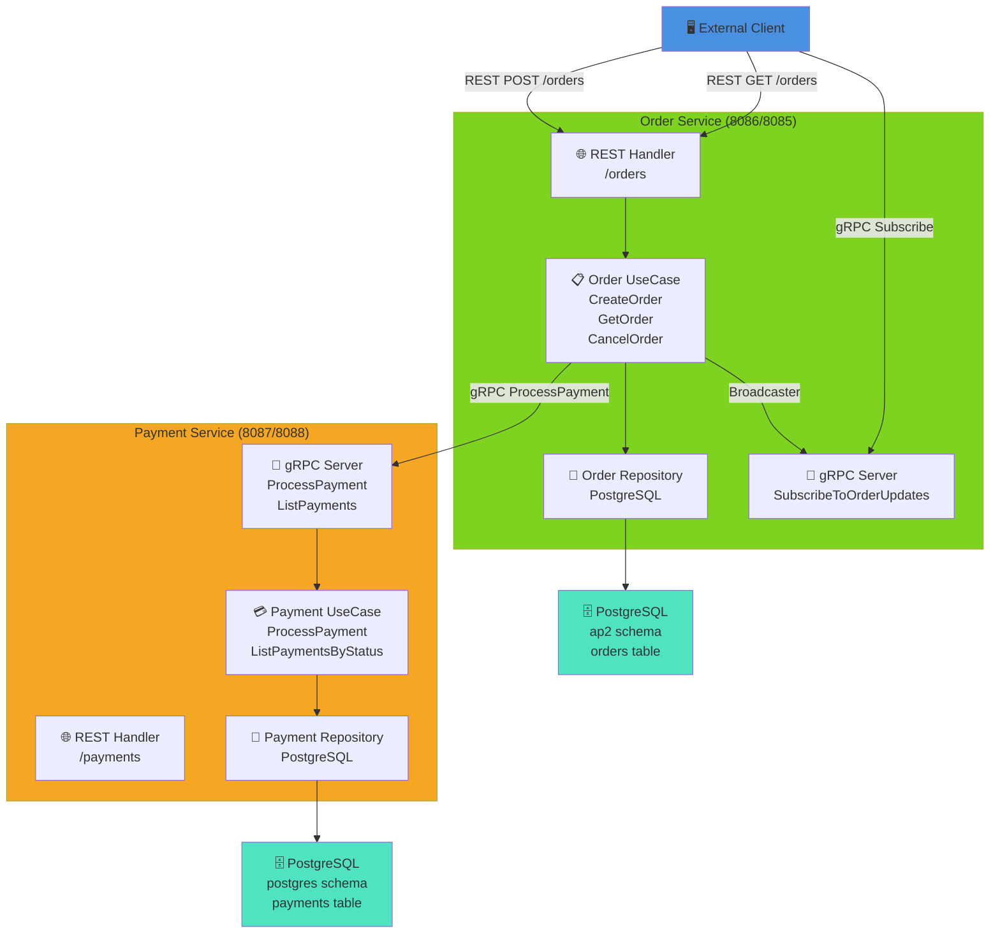

---

## Create Order Flow (Sequence Diagram)

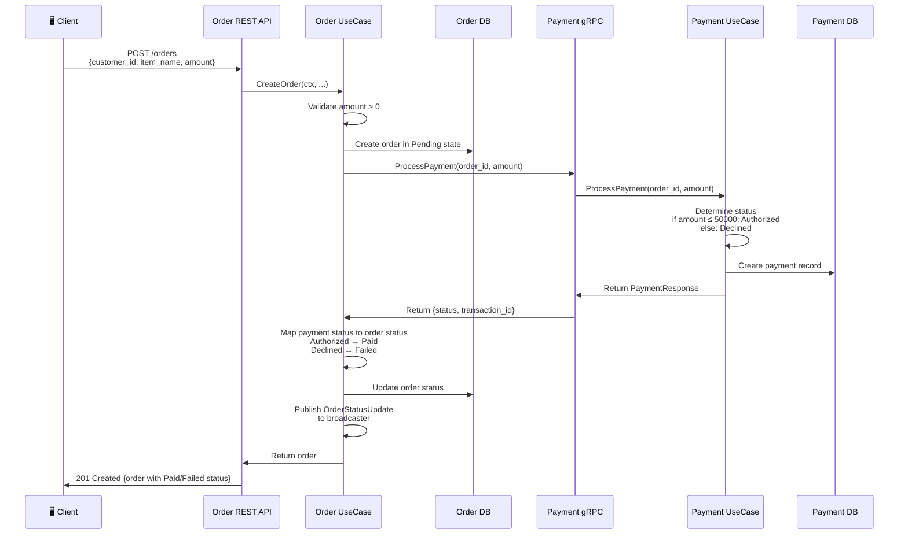

---

## Subscribe to Order Updates (gRPC Streaming)

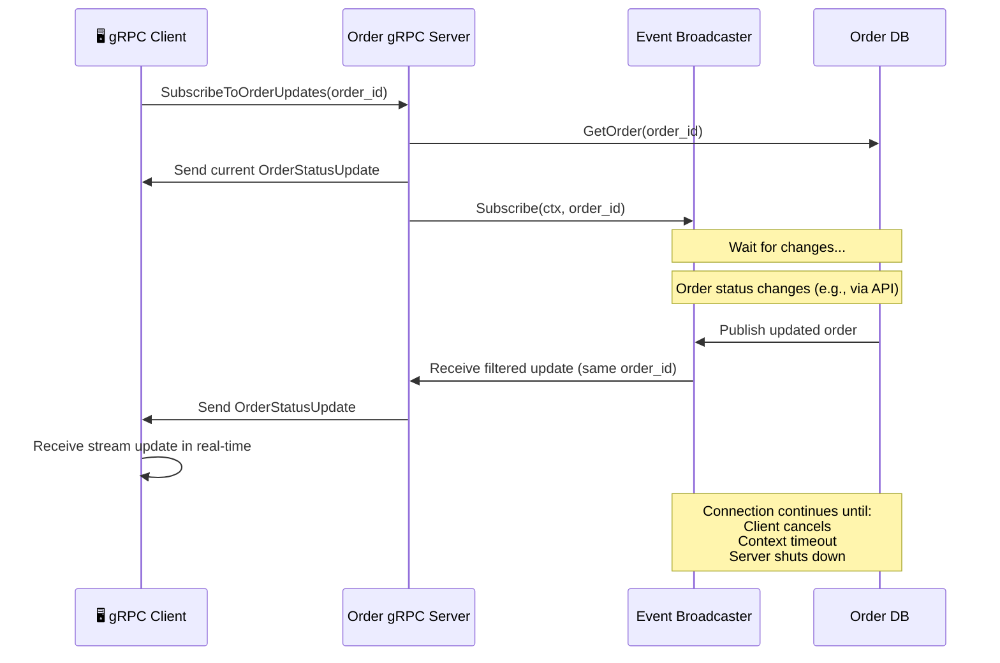

---

## Component Interaction Diagram

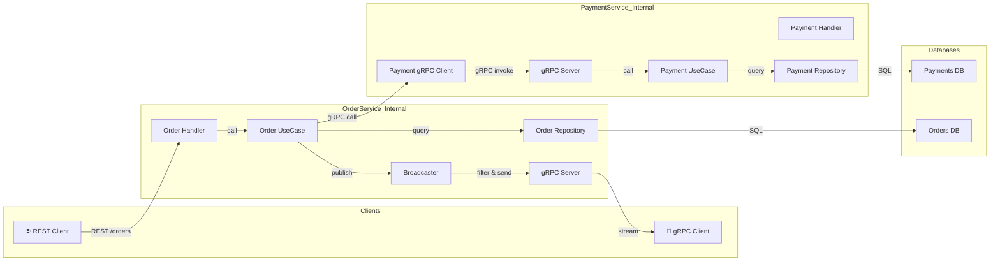

---

## Data Flow for Different HTTP Methods

### POST /orders (Create Order)

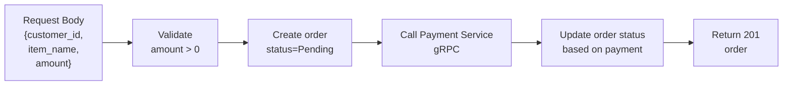

### GET /orders (List Orders)

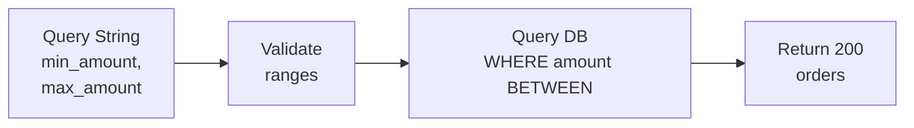

### PATCH /orders/:id/cancel (Cancel Order)

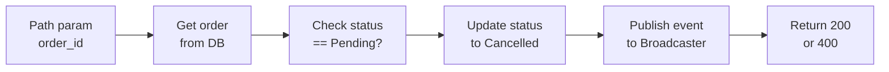

---

## gRPC Service Definition

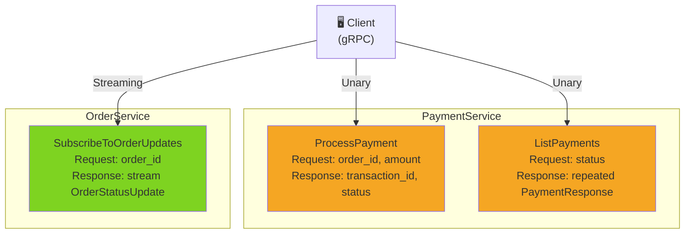

---

## Error Handling Flow

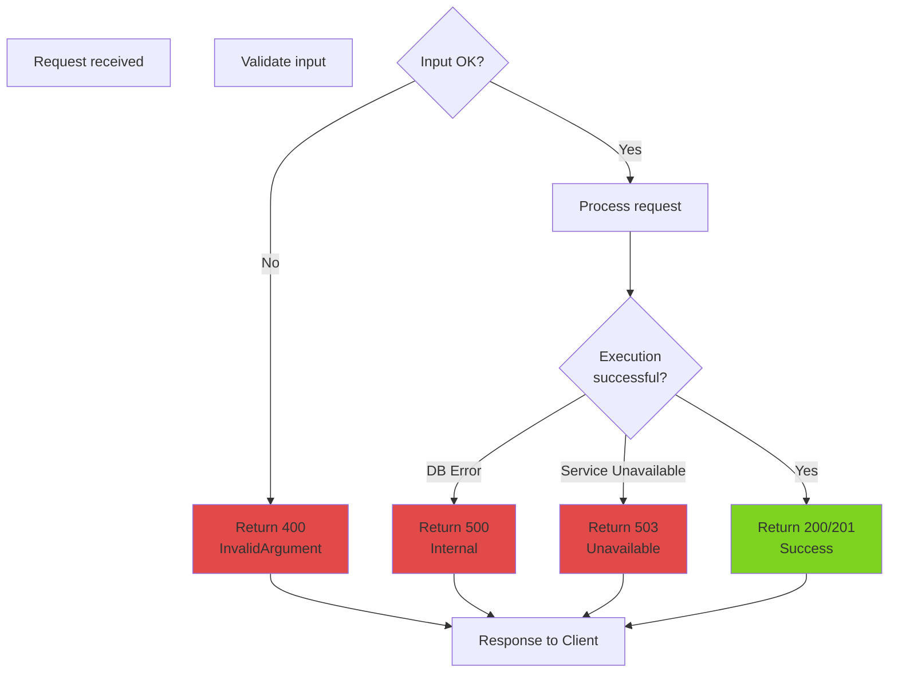

---

## Database Schema Relationships

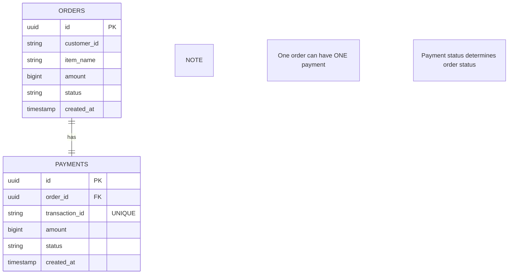

---

## Deployment Architecture

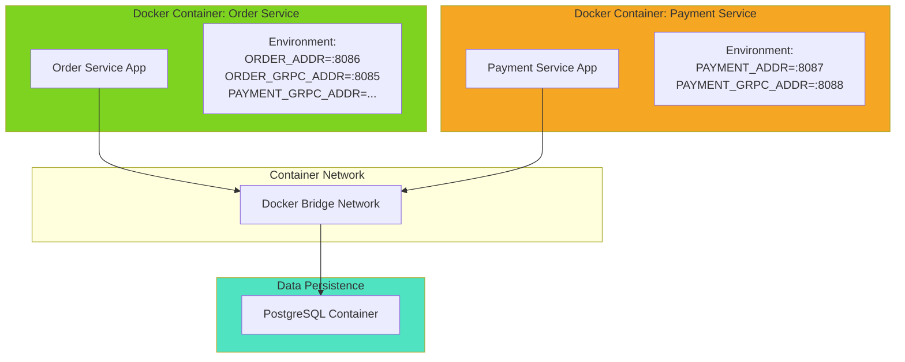

---

# 📊 Lectures 7-9: Redis Caching, Provider Adapter & Background Jobs

## Architecture with Redis & Notification Service

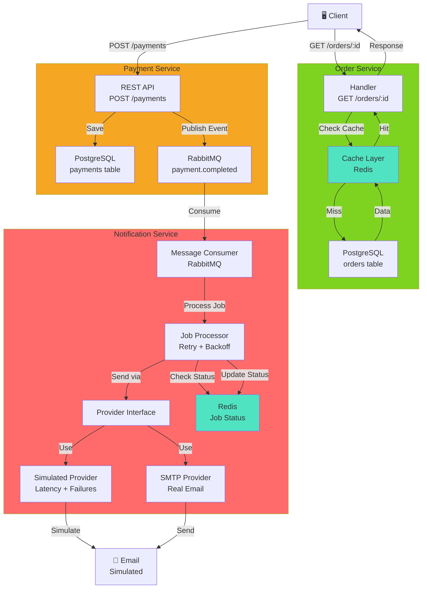

---

## Cache-Aside Pattern: GET Order

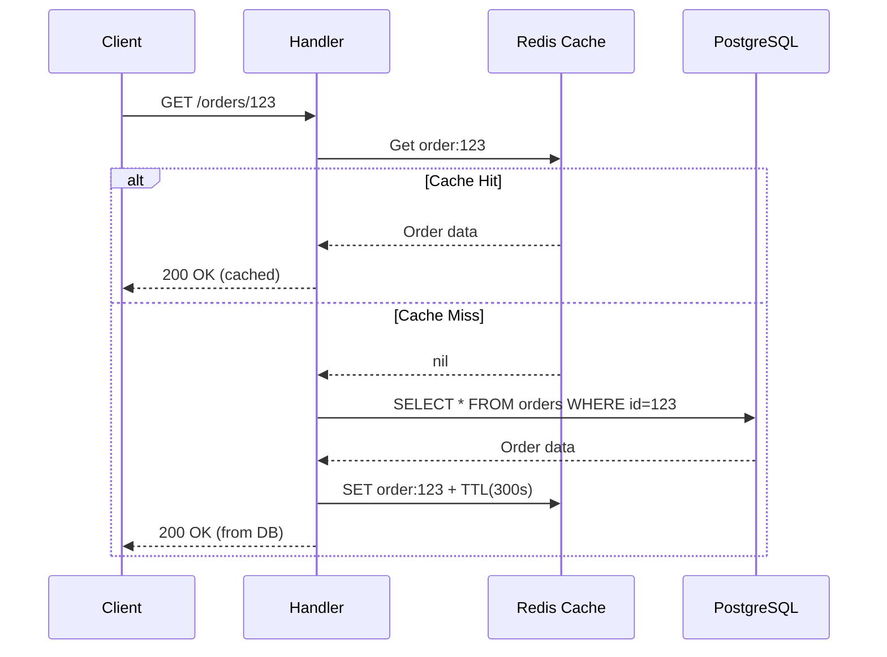

---

## Cache Invalidation on Status Change

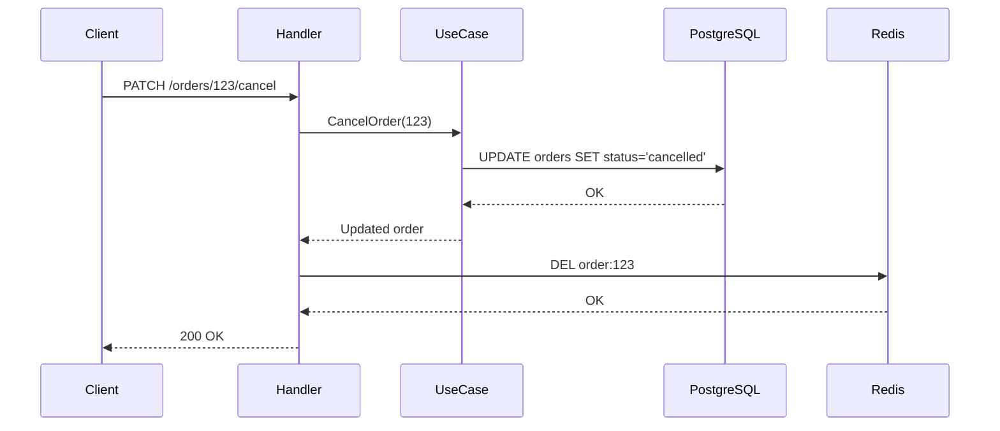

---

## Background Job Processing with Retry & Idempotency

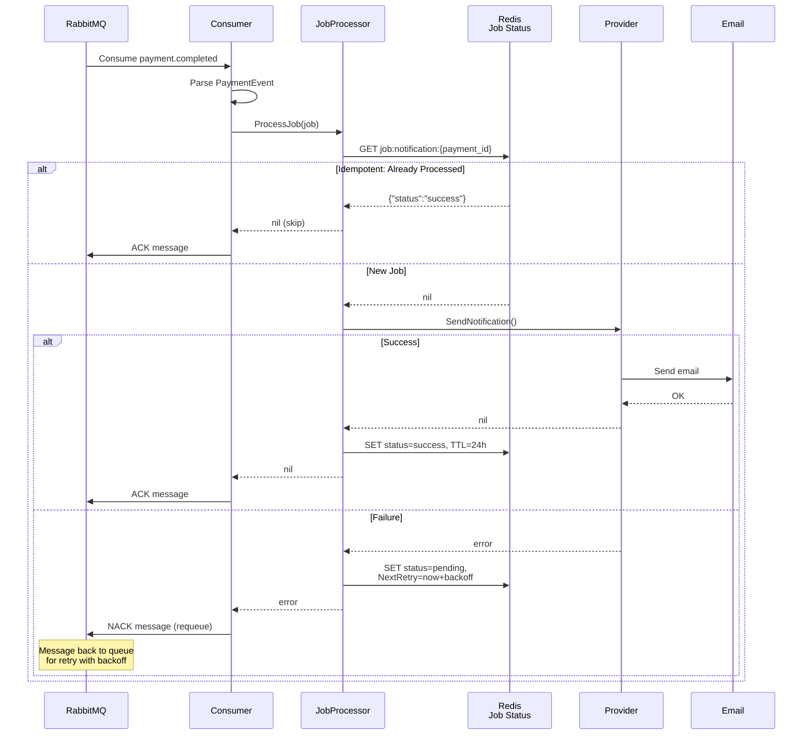

---

## Exponential Backoff Timeline

```
Attempt 1 (Time: 0s)
    │ FAIL
    ├─ Backoff: 2000ms * 2^0 = 2s
    └─ NextRetry: now + 2s
          │
          └──────────────────────▶ Wait 2 seconds

Attempt 2 (Time: +2s)
    │ FAIL
    ├─ Backoff: 2000ms * 2^1 = 4s
    └─ NextRetry: now + 4s
          │
          └──────────────────────────────────▶ Wait 4 seconds

Attempt 3 (Time: +6s)
    │ FAIL
    ├─ Backoff: 2000ms * 2^2 = 8s
    └─ NextRetry: now + 8s
          │
          └──────────────────────────────────────────────────▶ Wait 8 seconds

Attempt 4 (Time: +14s)
    │ SUCCESS ✓
    └─ Job completed, stop retrying
```

---

## Provider Adapter Pattern

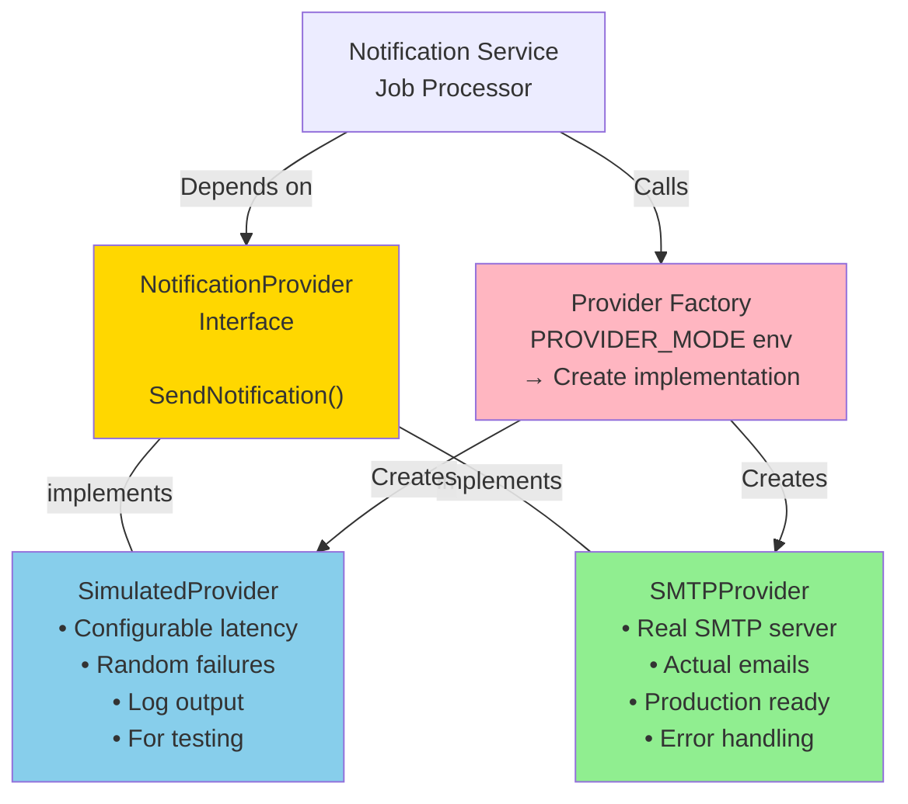

---

## Data Storage: Redis Key Patterns

```
Job Status (Idempotency):
┌─────────────────────────────────────────┐
│ Key: job:notification:{payment_id}      │
│ TTL: 24h (success), 7d (failed)         │
│                                          │
│ Value:                                   │
│ {                                        │
│   "status": "success|pending|failed",   │
│   "attempt_count": 1,                    │
│   "last_attempt": "2024-05-14T...",      │
│   "next_retry": "2024-05-14T...",        │
│   "error": "simulated error"             │
│ }                                        │
└─────────────────────────────────────────┘

Order Cache (Cache-Aside):
┌─────────────────────────────────────────┐
│ Key: order:{order_id}                   │
│ TTL: 300s (configurable)                │
│                                          │
│ Value:                                   │
│ {                                        │
│   "id": "order-123",                     │
│   "customer_id": "cust-456",             │
│   "item_name": "Widget",                 │
│   "amount": 1000,                        │
│   "status": "PENDING|PAID|CANCELLED"     │
│ }                                        │
└─────────────────────────────────────────┘
```

---

## Component Interactions Summary

| Feature | Component | Lecture | Pattern |
|---------|-----------|---------|---------|
| Order caching | Redis + Order Service | 7 | Cache-aside |
| Cache invalidation | Handler + Redis | 7 | Atomic updates |
| Notification provider | NotificationProvider interface | 8 | Adapter |
| Provider selection | Factory + Env config | 8 | Factory |
| Job processing | JobProcessor + RabbitMQ | 8-9 | Background worker |
| Idempotency | Redis job status | 8-9 | Idempotency record |
| Retry logic | JobProcessor | 8-9 | Retry pattern |
| Exponential backoff | JobProcessor | 8-9 | Backoff strategy |

---

## Configuration Layer

```yaml
Environment Variables:
├── REDIS_URL: redis://localhost:6379
├── CACHE_TTL_SECONDS: 300
├── PROVIDER_MODE: SIMULATED|REAL
├── SIMULATED_FAILURE_RATE: 0.2
├── SIMULATED_LATENCY_MS: 500
├── PROVIDER_RETRY_MAX_ATTEMPTS: 5
├── PROVIDER_RETRY_INITIAL_BACKOFF_MS: 2000
├── PROVIDER_RETRY_MAX_BACKOFF_MS: 32000
└── SMTP_*: For REAL provider mode
```

All behavior controlled by environment variables - no code changes needed!
