# 🏗️ Architecture Diagrams

## System Architecture

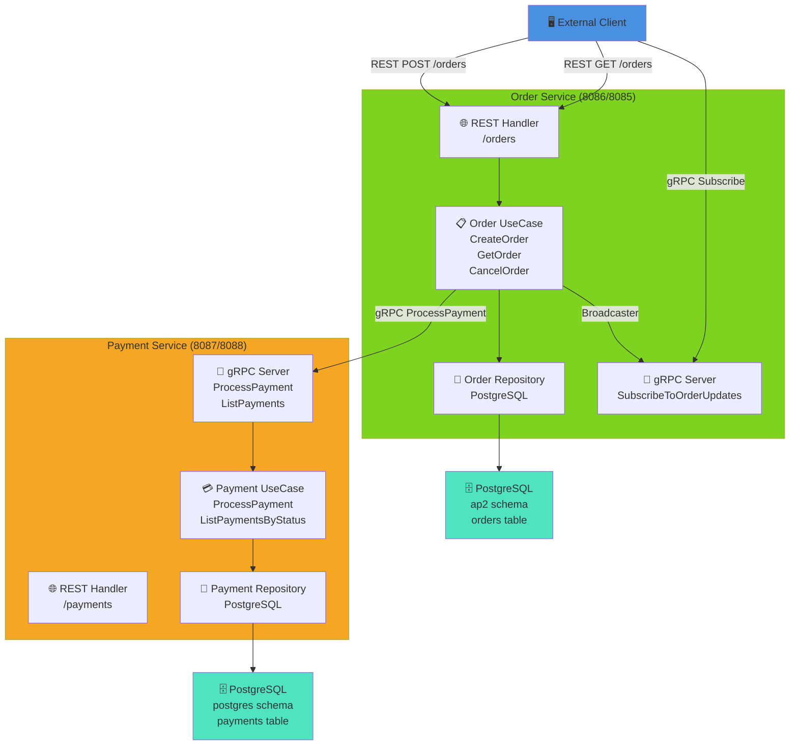

---

## Create Order Flow (Sequence Diagram)

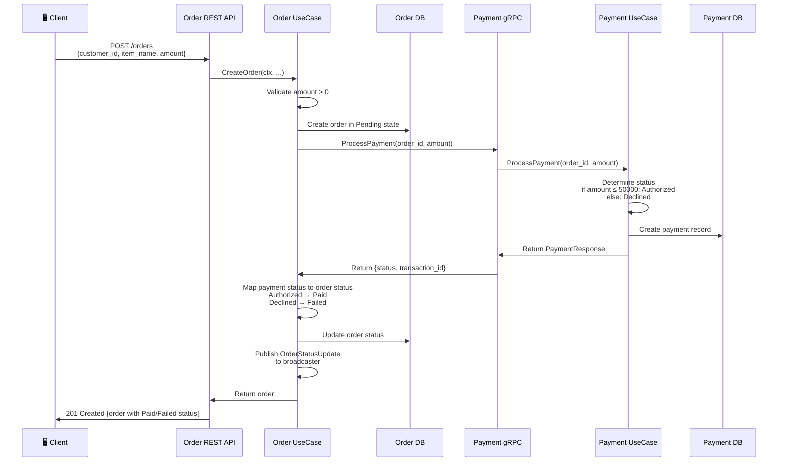

---

## Subscribe to Order Updates (gRPC Streaming)

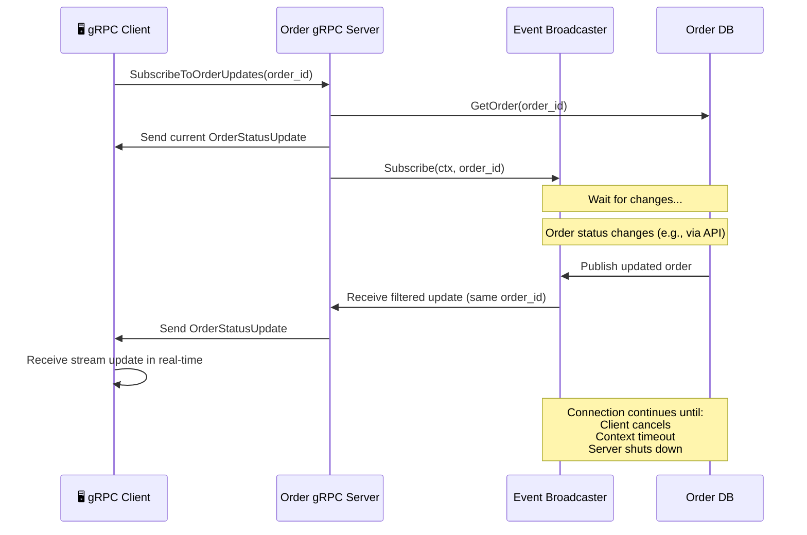

---

## Component Interaction Diagram

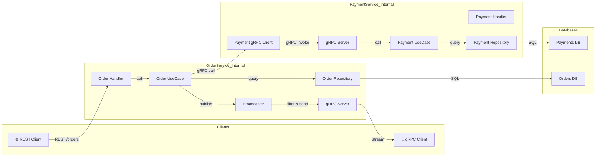

---

## Data Flow for Different HTTP Methods

### POST /orders (Create Order)

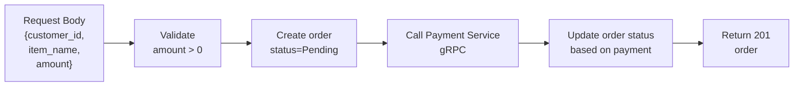

### GET /orders (List Orders)

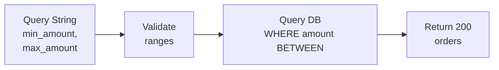

### PATCH /orders/:id/cancel (Cancel Order)

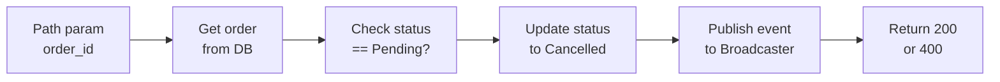

---

## gRPC Service Definition

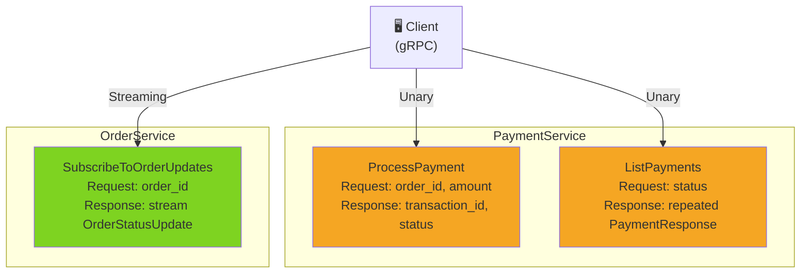

---

## Error Handling Flow

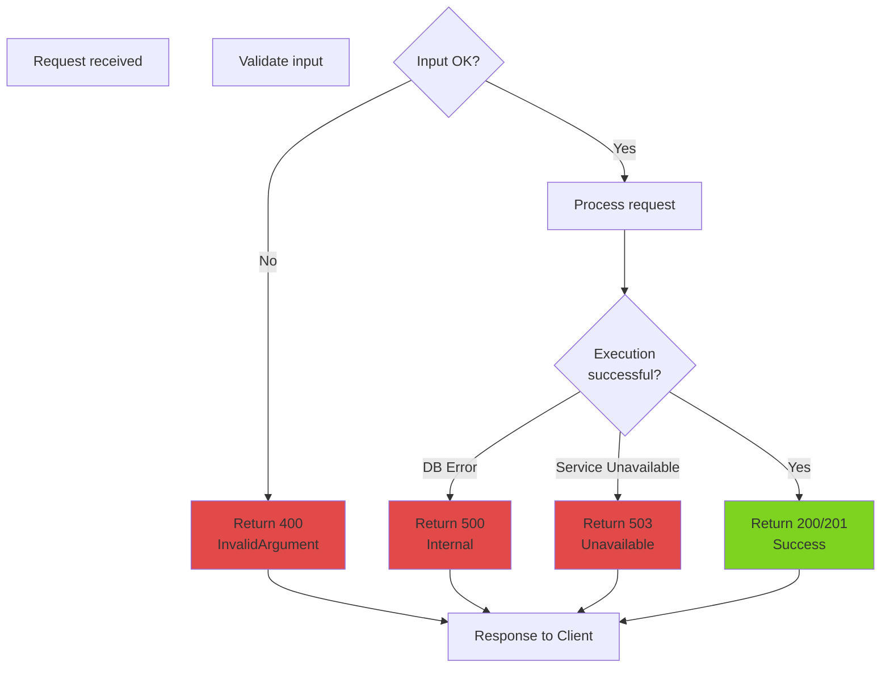

---

## Database Schema Relationships

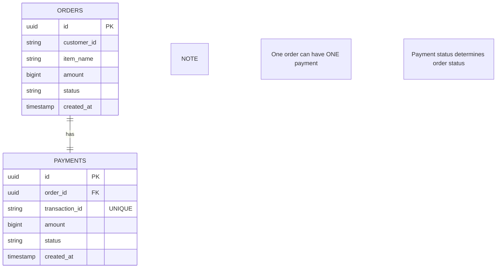

---

## Deployment Architecture

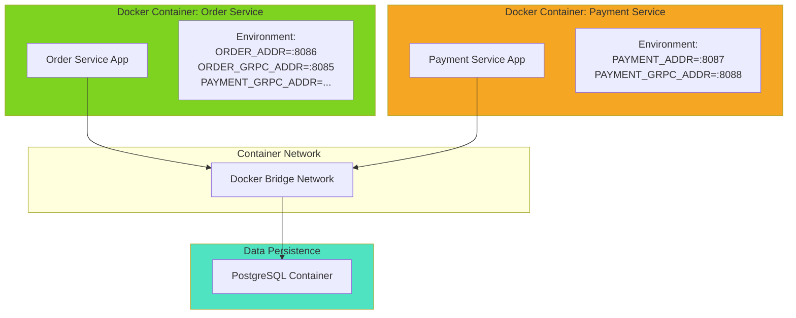
